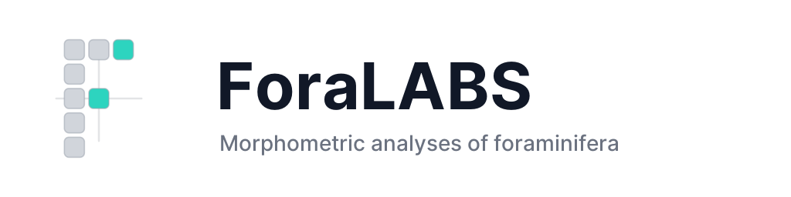
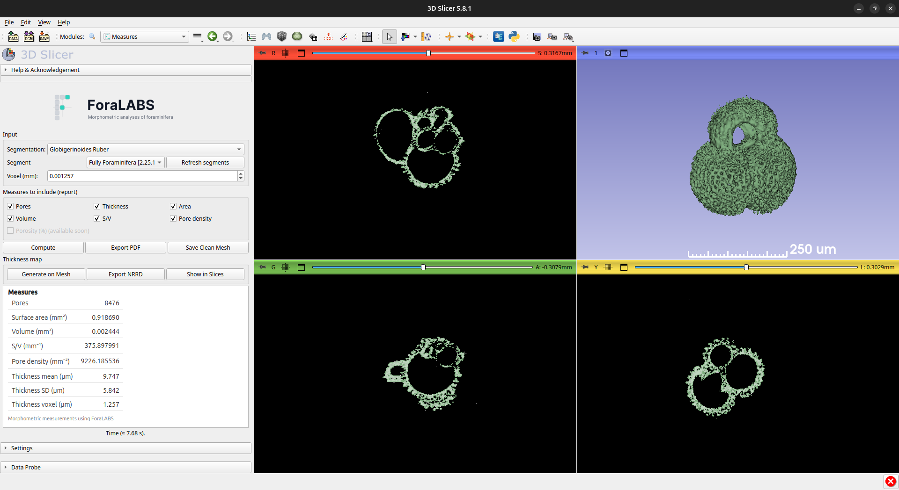

<div align="center">
  
</div>

# ForaLABS – microCT tools for foraminifera (3D Slicer modules)

[](#-installation)
[](#-license)
[](#-status)

The ForaLABS is a set of 3D Slicer modules customized for the micro-CT analysis of foraminifera tests and similar porous structures. It simplifies image processing, volume extraction, and 3D geometric operations into a streamlined, user-friendly interface.

## What is ForaLABS doing?

ForaLABS acts as a dedicated pipeline within 3D Slicer for scientists and researchers working with micro-CT (computed tomography) scans of foraminifera. Its primary goal is to automate the extraction of morphometric features.



It currently consists of two main modules:

### 1. Measures

The flagship module that performs analysis on segmented 3D geometries (surface meshes) directly extracted from the 3D volumes.

- **Morphometric measurements**: Computes Total Surface Area (mm²), Volume (mm³), and the Surface-Volume ratio (S/V).
- **Pore Statistics**: It counts the number of pores using a topological proxy, counts the number of Euler characteristic and genus, and determines the overall pore density (counts/mm²).
- **Thickness Mapping**: Calculates the thickness of the tests over the structure using Maurer signed distance. Generates a color map of the thickness in the 3D mesh and exports a NRRD volumetric file.
- **Automated Mesh Cleaning**: Operations akin to MeshLab directly within Slicer, allowing isolation of functional geometries and removal of small disconnected fragments (islands) based on adjustable bounding box thresholds.
- **Reporting**: Generates a one-click automated HTML report inside the application with all computed metrics (Pores count, Porosity, Area, Volume, etc.), which can be instantly exported to PDF.

### 2. ImportTXM

A specialized image importing module.

- **Zeiss TXM Support**: Directly imports reconstructed images coming from Zeiss X-Ray microscopy systems without the need for intermediate 3rd-party image conversion scripts.
- **Metadata Management**: It records the following metadata that can be viewed.
  - Pixel size
  - Iage width
  - Image height
  - Number of images
  - Binning
  - Bits per pixel
  - Optical magnification
  - Voltage (kV)
  - Current (µA)
  - Exposure Time (s)
  - Source to RA Distance (cm)
  - Detector to RA Distance (cm)
  - Source filter

---

## Installation

> Requires **3D Slicer 5.8.x** (or most recent).

1. Clone or download this repository:
   ```bash
   git clone https://github.com/HarlleyHauradou/SlicerForaLABS.git
   ```
2. Add the repo as an additional module path in Slicer:
   - **Edit ▸ Application Settings ▸ Modules ▸ Additional module paths** → **Add** the cloned folder and **Restart** Slicer.
   - (Alternatively) copy the module folders directly into your local Slicer **Modules** directory.
3. After restart, open **ForaLABS ▸ Measures** or **ForaLABS ▸ ImportTXM** from the Modules drop-down menu.

---

## Quickstart (Measures)

1. Load your micro-CT image and segment the region to be analyzed.
2. Navigate to **ForaLABS ▸ Measures**.
3. Select your active **Segmentation** node and choose the specific **WALL** (shell) segment you wish to analyze.
4. (Optional) In settings adjust the **Min diameter (% diag)** to effectively remove internal/external disconnected material. Use toggle **Remove unreferenced** for vertices cleanup.
5. Set the computation grid size using **Thickness voxel (mm)** (typical microCT shells use ~1–5 µm; enter in **mm**, e.g. `0.0015` for 1.5 µm).
6. Click **Compute** → a metrics **report** appears instantaneously on the panel.
7. Exploit the action buttons to record and visualize your data:
   - **Export** → saves a PDF replica (**Morphometric Analysis Report**) of the metrics report (**MAR_ForaLABS.pdf**).
   - **Generate Thickness Map** → paints the 3D mesh globally with computed thickness.
   - **Export Thickness (NRRD)** → saves the 3D numerical thickness map volume (in mm).
   - **Show Thickness in Slices** → exhibits the 3D map in 2D viewports with an intuitive Red/Yellow/Green pseudo-colormap.
   - **Save Clean Mesh** → extracts an STL/PLY file of the isolated shell.

---

## Methodological Summary

- **Island Removal / Mesh Cleaning**: Performs an automatic connected component split. It evaluates the bounding box diagonal per component and retains only those exceeding the specified threshold (defined as a percentage of the total mesh dimension).
- **Pore Count Formulation**: Evaluates pore count using a topological proxy that utilizes the Euler feature.
  $$
  \chi = V - E + F
  $$
  where V is the number of vertices, E is the number of edges, and F is the number of faces.
  The structural genus is calculated for each connected geometric region.
  $$
  g = \frac{2 - \chi}{2}
  $$
  The global summation yields the absolute pore count.
- **Thickness Logic**: Employs spatial voxelization (defined by user resolution) and evaluates the Maurer signed distance mapped relative to the generated internal medial surface. Results are exported natively in NRRD format and mapped symmetrically to all mesh surface geometries via interpolation.

---

## Status

[](#-status)
**Pre-release (v0.5.0)**: Core functions are deeply usable for analytical efforts, though architectural nuances and UX are actively refined.

---

## License

This project is licensed under the **Apache License 2.0**.  
See [`LICENSE`](./LICENSE) for details.

---

## Authors

- **Harlley Hauradou** (UFRJ – Nuclear Engineering Program)
- **Thaís Hauradou** (UFRJ – Nuclear Engineering Program)

Collaborations across academia and industry are strongly encouraged. Feel free to report issues, contribute, or open discussions regarding structural analysis of foraminifera!

---

## Cite

If you incorporate ForaLABS directly in academic work, please refer to this toolchain (and subsequent publications). Example:

```text
Hauradou H., Hauradou T. (2025). ForaLABS – microCT tools for foraminifera (3D Slicer modules).
GitHub repository: https://github.com/HarlleyHauradou/SlicerForaLABS
```
